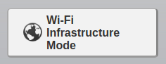

Sync your scanner with Paperless automatically
===

I like my scanner but unfortunately I don't really like to be forced to always extract the SD card and then upload it's content to my paperless instance.
That's why I created this small utility.

With this utility, **you simply scan your documents on the scanner and they get automatically imported to your [paperless-ng](https://github.com/jonaswinkler/paperless-ng]) instance** over the WIFI.


To have it working you have ton configure your scanner in **Infrastructure Mode**: 




## Compatible devices:
* [Brother DS820W](https://www.brother-usa.com/products/ds820w)

(If your scanner works too please send me the references so that I can adapt this doc :)

## Installation

### 1) Docker - easiest way
```bash
docker run sbeex/brothersyncscan:latest \
-e SCANNER_URL=<url of your brother scanner web ui> \
-e SCANNER_USERNAME=<username of your scanner web ui> \
-e SCANNER_PASSWORD=<password of your scanner web ui> \
-e PAPERLESS_URL=<url of paperless (incl port) ie: http://192.168.1.12:8000> \
-e PAPERLESS_USERNAME=<username of your paperless user> \
-e PAPERLESS_PASSWORD=<password of your paperless user account> 
```

### 2) Run python script
Alternatively you can run it via `python3 syncScanner.py`. 

(**Note:** this method require that you define the system properties declared in docker env variables yourself)

## How to contribute
Feel free to contribute to this project PR are always welcome.
It works with Python >=3

## Credits

Sebastien Vermeille <sebastien.vermeille@gmail.com> (Author)

## 

[](https://sonarcloud.io/dashboard?id=sebastienvermeille_paperless-sync-brother-scan)
